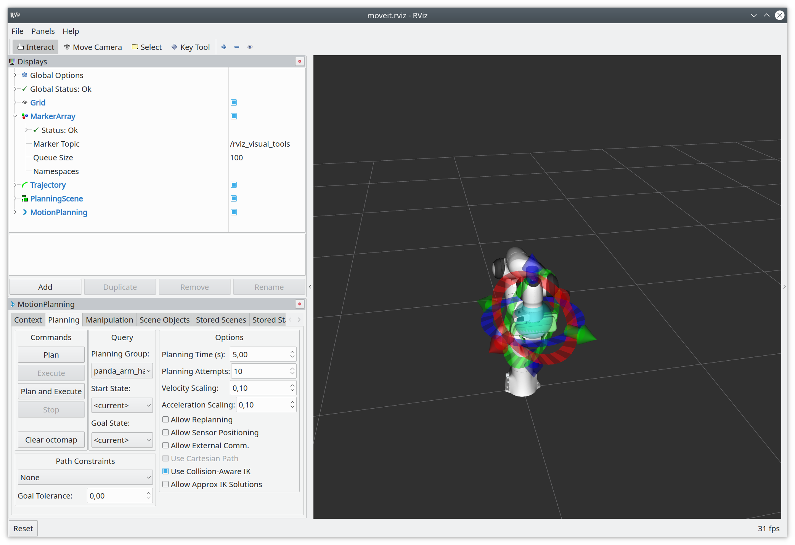

# easy_panda_moveit_config

This is an add-on for the upstream MoveIt! config for the Franka Emika Panda robot.

It replaces the MoveIt! RViz tutorial buttons with the planning interface.



### Play around with the robot in RViz

Prerequisite: `ros-noetic-moveit-resources-panda-moveit-config` is installed

```bash 
roslaunch easy_panda_moveit_config demo.launch
```

<!-- TODO

### Play around with the robot in RViz and Gazebo

```bash 
roslaunch easy_panda_moveit_config moveit_planning_execution.launch sim:=true 
```
-->

### Move the real robot

Prerequisite: clone this package recursively and build with Catkin, or use your existing source build of franka_ros and panda-moveit-config (must be up-to-date with the last SRDF fixes)

```bash 
roslaunch easy_panda_moveit_config moveit_planning_execution.launch robot_ip:=<YOUR ROBOT IP>
```

